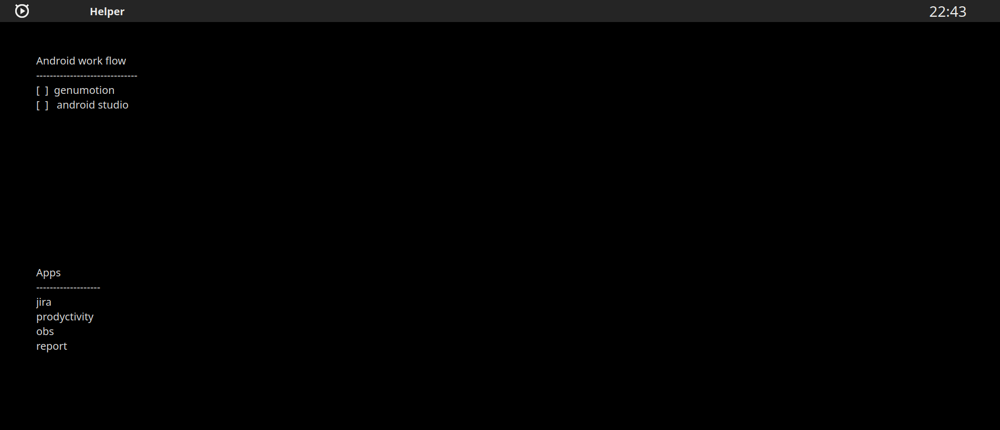

#### Виджеты рабочего стола
*  focus
*  application title
*  latte spacer
*  digital clock

#### Настройки темы
- Adwaita Dark KDE
- Reactionary 

#### Virtual Dectors
* help 
* working

#### KWin Scripts
* Hide Titles
* NoBorder Firefox when maximized

#### View
* calibre - ebook library
* files - file manager gnome, поиск
* firefox
* kde connect - для связи с android device
* Typora - markdown editor
* vlc
* Kate
* kfind -  полнотекствой поиск
* dTrumb Image Viewer

#### Productivity
* Super productivity - подтягивает задачи c jira, pomodoro
* Spectacle
* Safe Eyes
* SimpleNote
* Obs
* Telegram

#### Code
* Genumotion
* Android Studio
* Intellij // md editor  

#### Плагины для Android studio

* Visual Studio Code Dark Plus
* Git Commit Template
* Git Flow Integration
* Kotlin Fill Class
* Nyan Progress Bar
* RainBowBrackets
* pomodoro-timer

#### Дополненения

* GNOME Disks
  
**PlasmaWidget**
* Application title
* Fokus

### Setup Kubuntu

*  Setup drivier
*  Проверка работы камеры, принтера, наушников
*  Настройка монтирования дисков
*  Настройка рабочего стола
    * helper
    * work

* Установка тем
    * Темная
    * Светлая
 
* Образ диска
* Резервное копирование
        
### Проблемы

* прежде чем ставить новую версию, проверить совместимость
* странное поведение usb устройств
* перетаскивание в figma с зажатым alt, приводит к перетаскиванию окна
* не работает закрытие модальных окон в приложениях android studio, firefox по ctrl+f4

### В поиске

* mindmap editor

