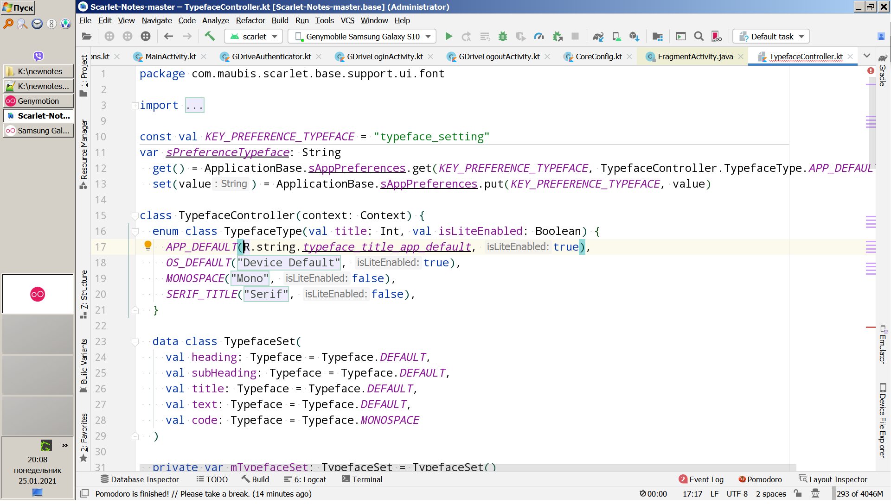
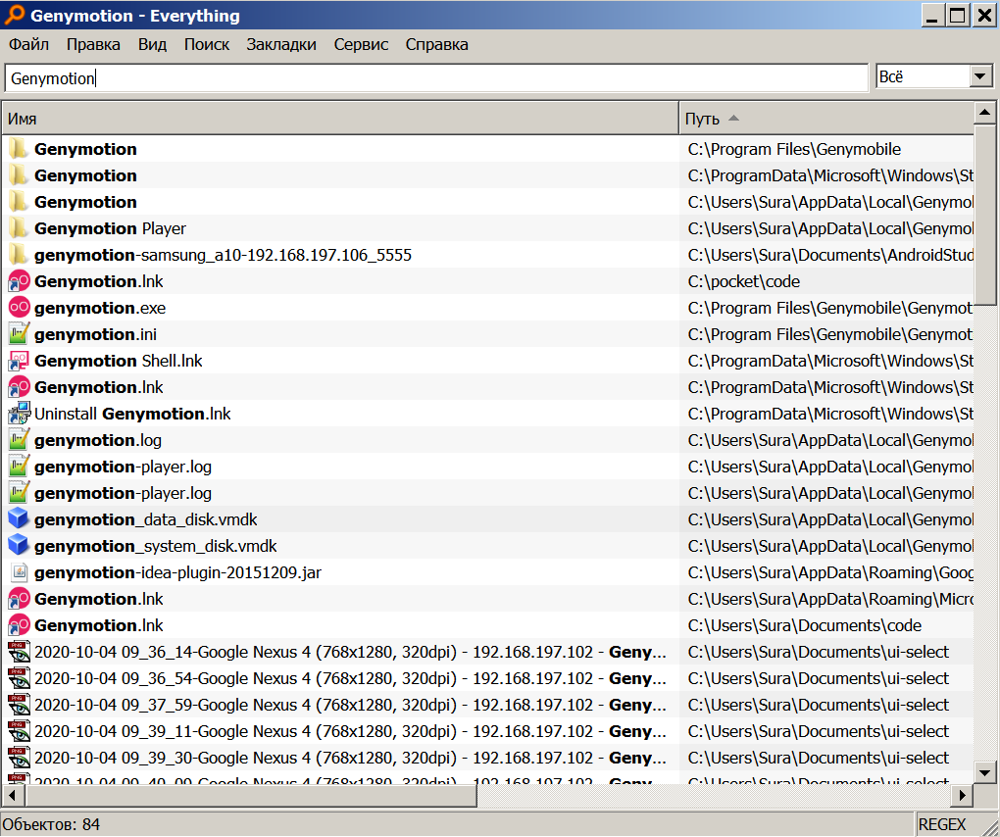
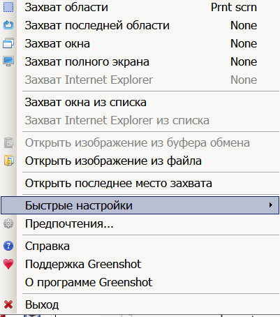

### Настройка рабочего стола 

- Боковая панель
    - everything
    - FileLocator
    - free alarm clock
    - Hourglassт
    - Natura sound     
- Dexpot - виртуальные рабочие столы 

### Productivity

* [Everything](#everything) - быстрый поиск файлов
* [GreenShoot](#greenshoot) -скрины
* Dexpot виртуальные рабочие столы
* FileLocator поиск файлов с Regex
* Free Alarm Clock - будильники в назначенное время
* Hourglassт-таймер для pomodoro.
* Natura Sound Therapy -генерация звуков для сосредоточенности
* f.lux
* OBS Studio

### Code

* Android Studio
* Genymotion

### Просмотр и редактирование
* ACD Systems
* Notepad++
* MindManager 
* Typora
* VMware
* VCL Media Player
* Illustrator

### Portable

* TotalCmd

### Плагины для Android studio

* Git Commit Template
* Git Flow Integration
* Kotlin Fill Class
* Nyan Progress Bar
* RainBowBrackets
* pomodoro-timer

### 1. Everything

Everything - быстрый поиск файлов на всех дисков

### 2. Greenshoot

greenshoot - скриншотер
