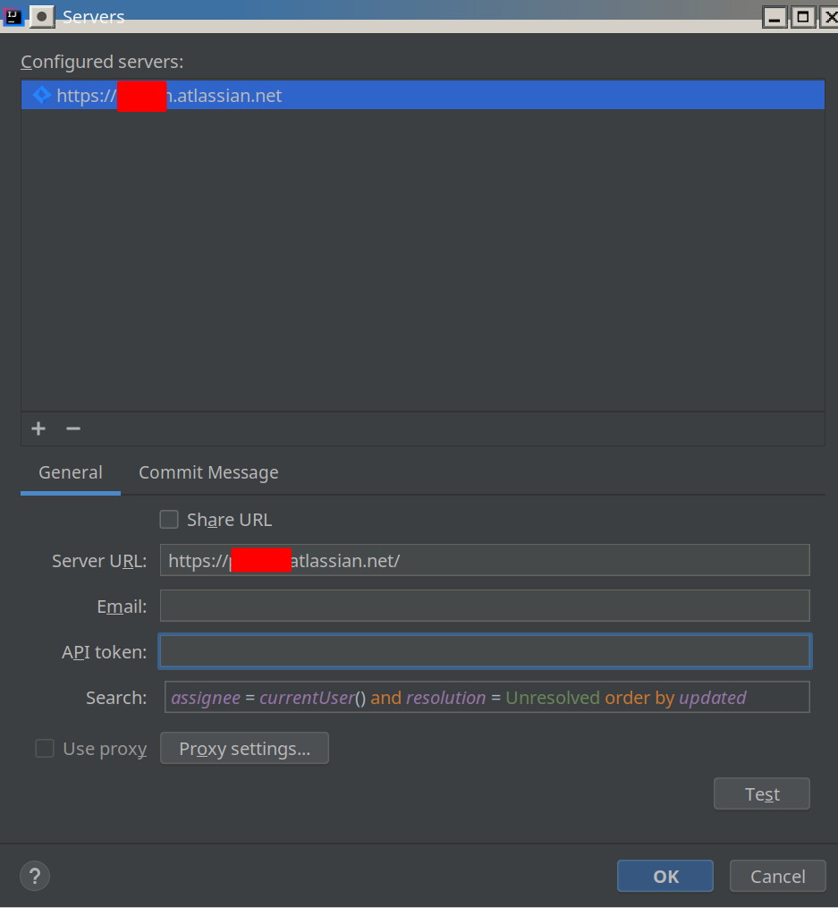
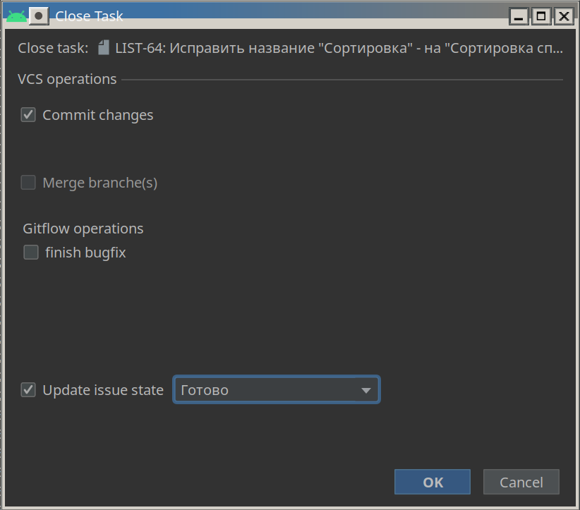
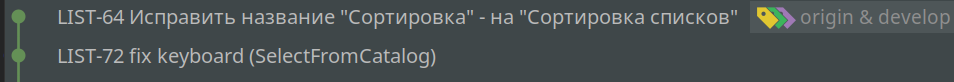

### Настройка
Tools > Tasks & Contexts > Configure Servers…

Alt+Insert  >  select "Jira"

| Server URL | https://companyname.atlassian.net                            |
| ---------- | ------------------------------------------------------------ |
| Email      | зарегистрированный в atlassian                               |
| API token  | [генерация в профиле](https://id.atlassian.com/manage/api-token) |
| Search     | поисковый запрос, для отображения задач

**Пример запроса**

assignee = currentUser() AND sprint in openSprints() AND resolution = Unresolved order by updated

**Проблемы**:

* в ubuntu >  подвигать границы окна, чтобы все поля были видны

### Работа в Android Studio

Tools > Tasks & Contexts > Open Task

* создается ветка
* создается change list
  

Tools > Tasks & Contexts > close Task
* commit changes (message = title in task jira)
* обновление статуса в jira
  
  

! Не корректная работа с плагином GitFlow, поэтому branch
нужно закрывать вручную через контекстное меню.

**Итоговый вид коммитов**

